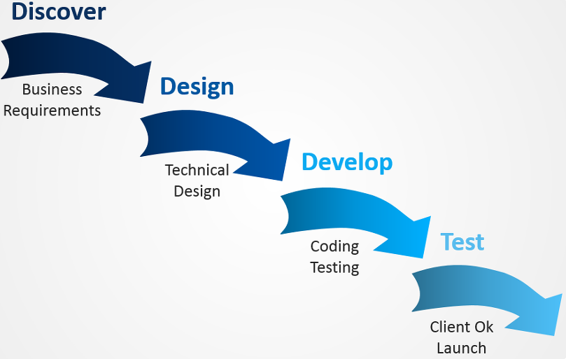
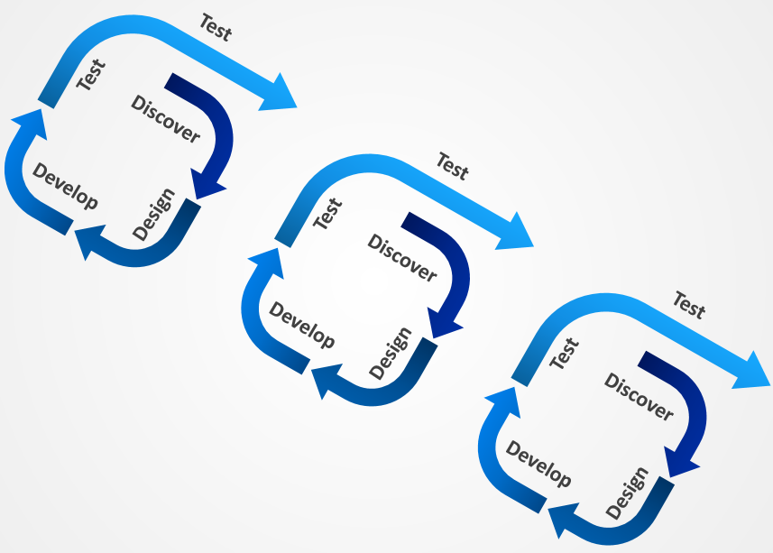

### ⭐ 오늘의 키워드 ⭐
| No.  |     키워드      | 부가설명 |
|------|:------------:|:----:|
| 01   | 소프트웨어 개발 방법론 |      |
| 01-1 |   폭포수 방법론    |      |
| 01-2 |   애자일 방법론    |      |
| 02   |     POJO     |      |
| 03   |     zuul     |      |
| 03-1 | eureka |      |
| 03-2 | Histrix |      |

<br/>

### ✔ 소프트웨어 개발 방법론

```aidl
소프트웨어 개발 방법론이란, 소프트웨어를 개발하기 위한 구체적인 절차, 방법 기술 등을 정리 한 것이다.
```

<br/>

### ✔ 폭포수 방법론 Waterfall Methodology

```aidl
폭포수 방법론은 개발 생명주기가 순차적으로 "일련의 단계"로 나누어 개발하는 방법을 의미한다.
```

🚩 계획 및 분석 - 설계  - 개발 - 테스트 - 운영/유지보수 단계

◼ 계획 및 분석 : 요구 분석, 문제 해결 방법 도출 수행 단계

◼ 설계 : 구조 설계, 디자인, 상세 설계 수행 단계

◼ 개발 : 코딩, 모듈 테스트, 통합 테스트 수행 단계

◼ 테스트 : 시스템 테스트, 사용자 테스트, 인수 테스트 수행 단계

◼ 운영/유지보수 : 운영, 유지보수, 보완, 기능 추가 수행 단계




*출처 :&amp;nbsp;http://www.incodom.kr/%ED%8F%AD%ED%8F%AC%EC%88%98_%EB%B0%A9%EB%B2%95%EB%A1%A0*

<br/>

### ✔ 애자일 방법론 Agile Methodology

```aidl
"반복적이고 점진적인 개발 방법"을 통해 개발을 진행하는 방법이다.
```

🚩 계획 및 분석 - 설계 - 개발 - 테스트  👉 작은 단위의 사이클로 분리 
🚩 칸반 / 스크럼 / 익트림 프로그래밍



*출처 :&amp;nbsp;https://blog.rightbrain.co.kr/?p=5810*

◼ 스프린트 : 고객 요구사항에 대한 개발을 정해진 기간 안에 완료하는 `작업 주기`

◼ 백로그 : 개발할 기능 또는 작업 `목록`

◼ 스탠드업 미팅 : 스크럼에서 사용되는 미팅으로 `진행 상황`과 `문제`를 `공유`

◼ 이터레이션 : 반복적인 개발과 검증을 통해 소프트웨어를 개발하는 것

◼ 인큐베이션 : 새로운 아이디어나 기능을 개발하기 전에 실험적으로 검증하는 단계


