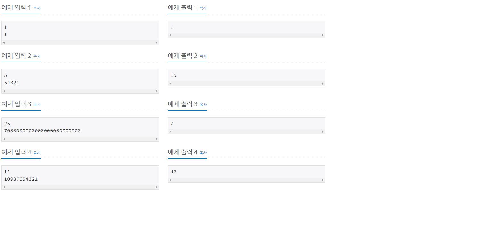

[BOJ URL](https://www.acmicpc.net/problem/11720)

### 📢 문제 정리
> **문제**
> 
>N개의 숫자가 공백 없이 쓰여있다. 이 숫자를 모두 합해서 출력하는 프로그램을 작성하시오.

> **입력**
> 
> 첫째 줄에 숫자의 개수 N (1 ≤ N ≤ 100)이 주어진다. 둘째 줄에 숫자 N개가 공백없이 주어진다.

> **출력** 
> 
> 입력으로 주어진 숫자 N개의 합을 출력한다.



### 🔍 해결 방법

1. 먼저 숫자의 개수 `N 문자`를 입력받는다.
2. `result` 변수를 이용하여 `N개의 합 변수`를 `초기화`한다.
3. `string 배열`로 받아 `split()` 를 이용하여 잘라준다.
4. `반복문`을 통하여 `result` 에 더해준다.
5. `result 값`을 `출력`한다.


<br/>

### 📌 코드 정리

```java
import java.io.*;
public class Main {
    public static void main(String[] args) throws IOException {
        BufferedReader br = new BufferedReader(new InputStreamReader(System.in));
        
        int n = Integer.parseInt(br.readLine());
        int result = 0;
        
        String[] str = br.readLine().split("");
        
        for(String a : str) {
            result += Integer.parseInt(a);
        }
        
        System.out.println(result);
    }
}
```