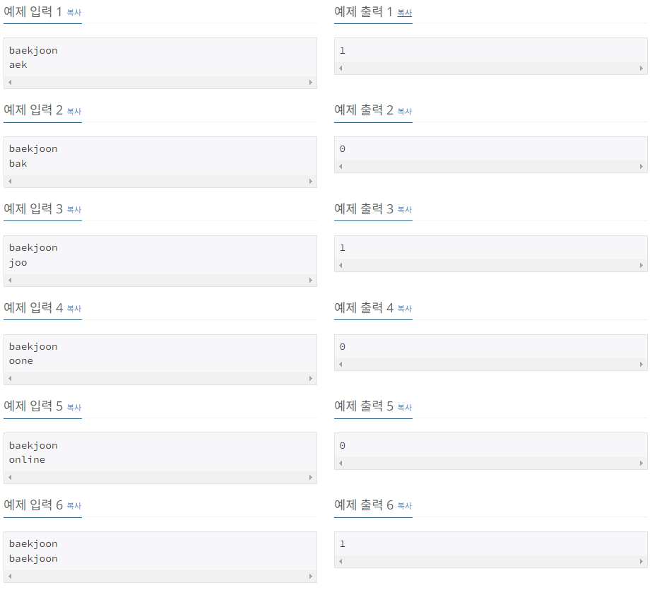
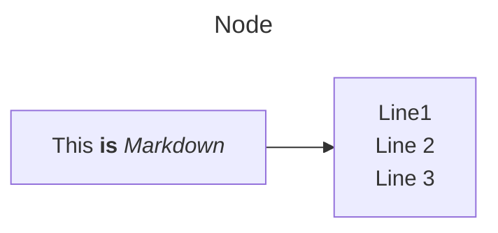

[BOJ URL](https://www.acmicpc.net/problem/16916)

### 📢 문제 정리
> **문제**
>
> 문자열 S의 부분 문자열이란, 문자열의 연속된 일부를 의미한다. 
> 예를 들어, "aek", "joo", "ekj"는 "baekjoon"의 부분 문자열이고, "bak", "p", "oone"는 부분 문자열이 아니다.
문자열 S와 P가 주어졌을 때, P가 S의 부분 문자열인지 아닌지 알아보자.

> **입력**
>
> 첫째 줄에 문자열 S, 둘째 줄에 문자열 P가 주어진다. 
> 두 문자열은 빈 문자열이 아니며, 길이는 100만을 넘지 않는다. 또, 알파벳 소문자로만 이루어져 있다.

> **출력**
>
> P가 S의 부분 문자열이면 1, 아니면 0을 출력한다.



### 🔍 해결 방법


<br/>

### 📌 코드 정리

```java

```



test


